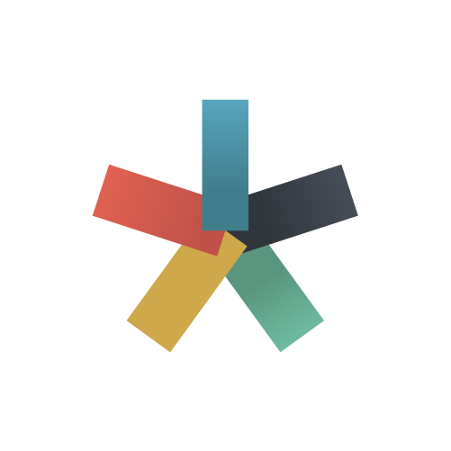
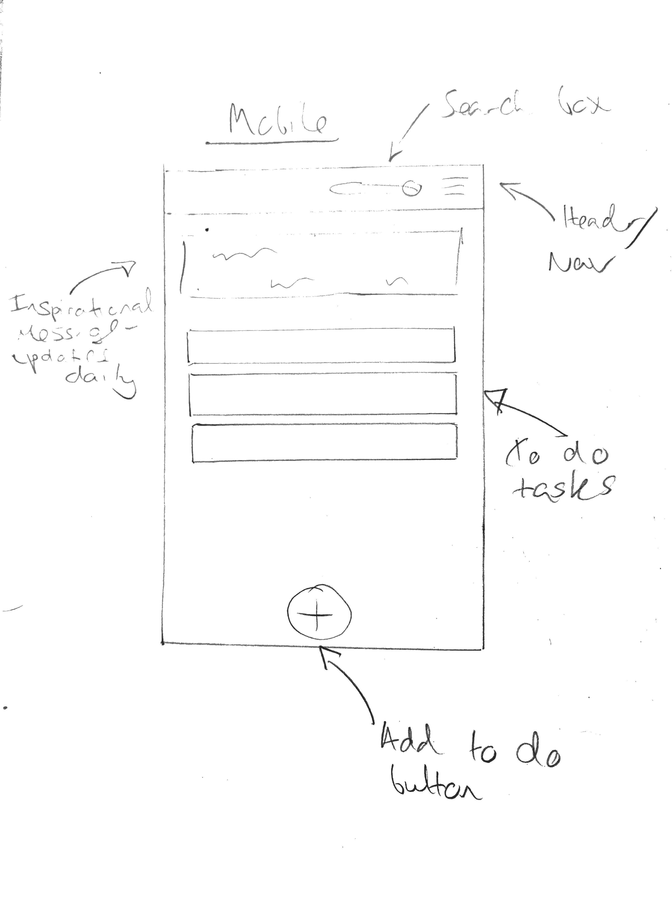
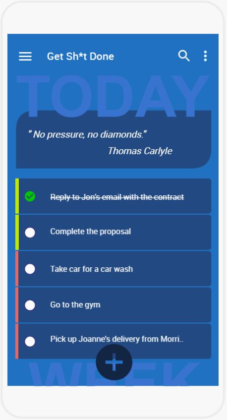
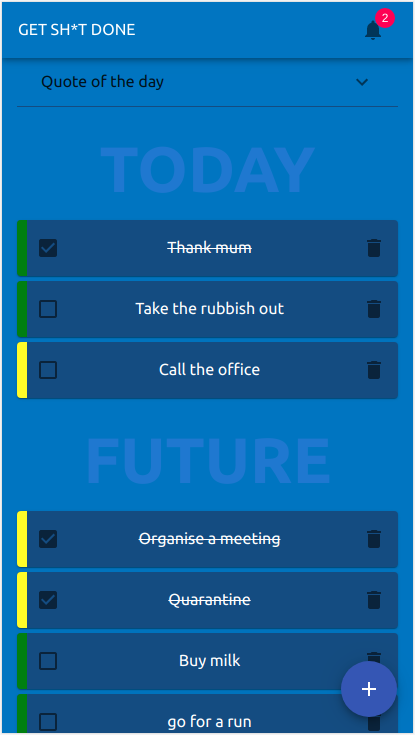

## TO DO App Project

    

This project was bootstrapped with [Create React App](https://github.com/facebook/create-react-app).
Currently building a To Do list application using React and Material-ui.

Aptly named Get Sh*t Done, a tong-in-cheek reference to one of the world's most popular productivity systems Get Things Done (GTD).

## Objectives
1. To develop a front-end application that utilises all CRUD operations using State Management in React.
2. Create a serverless Express.js API via the Serverless framework, using AWS Lambda.
2. Connect the front-end with a MySQL database backend hosted on AWS RDS, via Express API.

## Wireframes & Prototype Mockup
1. Initial template
Quick sketch to draw out the key features. (Apologies, I'm no artist).

    

2. Mockup using FluidUI

    

## Final App Design
Currently live and accessible via link above. I am really happy that I've managed to acheive my intended designs with React & Material-ui.

    

